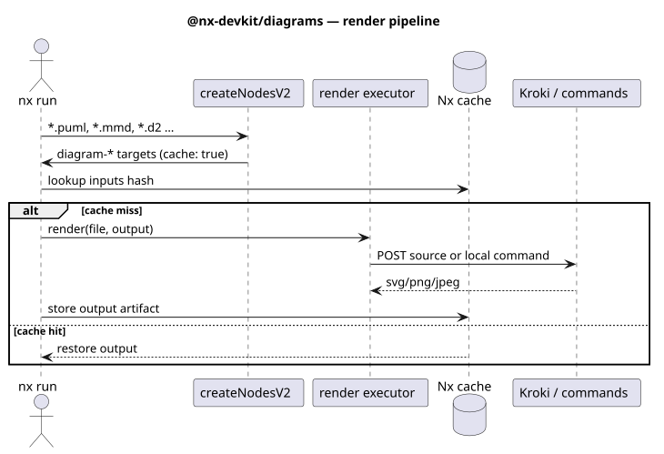
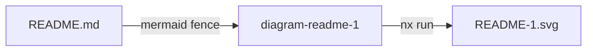

# @nx-devkit/diagrams

Zero-config Nx plugin that renders text-diagram sources to images — the Nx way. Every diagram file becomes a cached, atomized target: `nx affected` re-renders only changed diagrams, and Nx Cloud shares the artifacts.



Supported types (extension → renderer type; matching is case-insensitive, `.PUML` works too):

| Extension | Type |
|---|---|
| `.puml`, `.plantuml` | `plantuml` |
| `.mmd`, `.mermaid` | `mermaid` |
| `.dot`, `.gv` | `graphviz` |
| `.d2` | `d2` |
| `.bpmn` | `bpmn` |
| `.excalidraw` | `excalidraw` |

Markdown files (`**/*.md`) are sources too: every fenced block whose language maps to a type — ` ```mermaid `, ` ```plantuml `/`puml`, ` ```d2 `, ` ```dot `/`graphviz`, ` ```bpmn `, ` ```excalidraw ` — gets its own `diagram-<slug>-<n>` target rendering to `<fileName>-<n>.<format>` next to the file, where `<n>` is the block's 1-based ordinal among diagram fences in that file:




## Setup

```bash
bun add -D @nx-devkit/diagrams   # or npm/pnpm/yarn
bunx nx g @nx-devkit/diagrams:init
```

Or register manually in `nx.json`:

```jsonc
{
  "plugins": [
    { "plugin": "@nx-devkit/diagrams", "options": {} }
  ]
}
```

## What you get

For `packages/docs/diagrams/auth.puml` inside project `packages/docs`:

```jsonc
"diagram-diagrams-auth": {
  "executor": "@nx-devkit/diagrams:render",
  "cache": true,
  "inputs": ["{workspaceRoot}/packages/docs/diagrams/auth.puml"],
  "outputs": ["{workspaceRoot}/packages/docs/diagrams/auth.svg"],
  "options": { "file": "packages/docs/diagrams/auth.puml", "format": "svg", ... }
},
"diagrams": { /* aggregate: renders all of the project's diagrams */ }
```

```bash
bunx nx run docs:diagrams              # render all diagrams in the project
bunx nx run docs:diagram-diagrams-auth # render one
```

Per-file targets are the cache unit — each renders a single file, so unchanged diagrams are restored from cache. The aggregate `diagrams` target re-runs all of a project's diagrams when any of them changes (`nx affected -t diagrams`).

## Plugin options

```jsonc
{
  "plugin": "@nx-devkit/diagrams",
  "options": {
    "format": "svg",                  // svg | png | jpeg (default: svg)
    "krokiUrl": "https://kroki.io",   // or "docker" for an ephemeral local container; "" disables
    "krokiImage": "yuzutech/kroki:latest", // image used when krokiUrl is "docker"
    "outputDir": "{fileDir}",         // workspace-relative; tokens: {fileDir} {fileName} {projectRoot}
    "targetName": "diagrams",         // aggregate target name
    "include": ["docs/**"],           // extra filters over matched files
    "exclude": ["**/vendor/**"],
    "commands": {
      // per-type local renderers — win over Kroki when set
      "mermaid": "mmdc -i {input} -o {output}",
      "plantuml": "plantuml -t{format} {input} -o {fileDir}",
      "graphviz": "dot -T{format} {input} -o {output}"
    }
  }
}
```

Command placeholders — all workspace-relative: `{input}` (source file; for Markdown blocks a materialized temp file — absolute path, named `<fileName>-<n>` with the type's canonical extension), `{output}` (target image path), `{format}`, `{fileDir}` (source file's directory), `{fileName}` (basename without extension; `<basename>-<n>` for blocks), `{projectRoot}` (owning project root — `.` for the root project in commands, so `{projectRoot}/img` resolves to `./img`; in `outputDir` templates it expands to an empty prefix). Commands run with `cwd` = workspace root.

Placeholder values expand **shell-quoted** — paths with spaces stay single arguments — so do not wrap placeholders in your own quotes. Commands are workspace-authored configuration (same trust level as `nx:run-commands`); they run through a shell so pipes and redirects work.

`outputDir` uses the same workspace-relative tokens: the default `{fileDir}` colocates output next to the source; use `{projectRoot}/img` for a per-project image directory.

## Local Kroki via docker

Public `kroki.io` is rate-limited and sends your diagram sources to a third party. Set `"krokiUrl": "docker"` and the executor runs an ephemeral Kroki container per run — `docker run -d --rm -p 127.0.0.1::8000 yuzutech/kroki`, lazily on the first Kroki render, health-checked, then stopped when the run finishes (success or failure). Nothing persists between runs; set `krokiImage` to pin a digest or point at a mirror.

The core image covers plantuml, graphviz, d2 and friends — mermaid, bpmn and excalidraw are companion services in upstream Kroki and are not bundled. For those types combine docker mode with `commands` (commands always win per type), or run a full compose stack:

```jsonc
{ "options": { "krokiUrl": "docker", "commands": { "mermaid": "mmdc -i {input} -o {output}" } } }
```

```yaml
# docker-compose.yml
services:
  kroki:
    image: yuzutech/kroki
    ports: ["8000:8000"]
    environment:
      KROKI_MERMAID_HOST: mermaid
      KROKI_BPMN_HOST: bpmn
      KROKI_EXCALIDRAW_HOST: excalidraw
  mermaid:
    image: yuzutech/kroki-mermaid
  bpmn:
    image: yuzutech/kroki-bpmn
  excalidraw:
    image: yuzutech/kroki-excalidraw
```

Then `"krokiUrl": "http://localhost:8000"`.

## Committing images

Default output is colocated next to the source (`auth.puml` → `auth.svg`) so Markdown can reference it and it can be committed. If you render into `dist/`/`outputDir` build artifacts instead, gitignore them — targets are cached, so CI restores outputs from the Nx cache without re-rendering.
